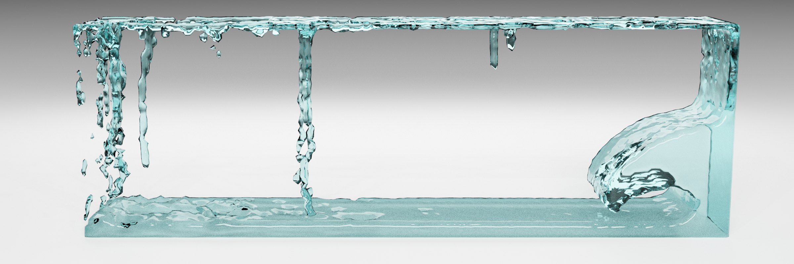
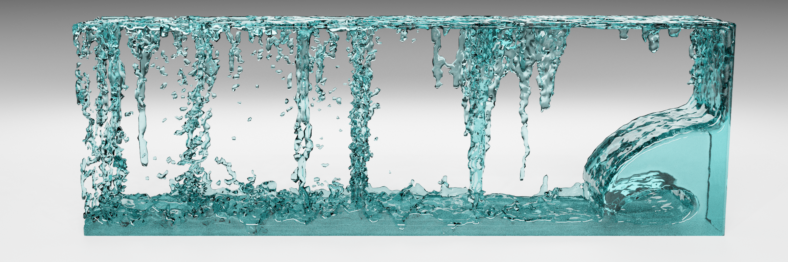

# WaterSim: optimised implementation of a FLIP algorithm




Fluid simulation via FLIP (Fluid Implicit Particle) Method.

This is a 3D FLIP solver originally implemented as part of the course Physically-Based Simulation for Computer Graphics (ETHZ autumn semester 2018), the goal of which was to create a [video of a meteorite crashing into the sea](http://seanbone.ch/site/wp-content/uploads/2019/03/meteorprojectvideo.mp4).
The project was revisited with a new team as part of the course Advanced Systems Lab (ETHZ spring semester 2021) with the objective of improving single-core numerical performance.

Original authors: Silvia Nauer, Mikael Stellio, Sean Bone.

Optimizations by: Christoph Amevor, Felix Illes, Mikael Stellio, Sean Bone.

Images: comparison of the visual improvements gained by optimising the algorithm. The bottom simulation has higher resolution, but took about the same time to compute as the top one, which was simulated with the unoptimised code.

# Cloning with submodules

This Git repository has a submodule for libigl. To clone it correctly use the following command:

    git clone --recurse-submodules git@github.com:SeanBone/WaterSim.git

For more details on the dependencies for `libigl`, check out the [`libigl` documentation](https://libigl.github.io/tutorial/).

### Note for linux users

On Ubuntu, install the following dependencies:

```
sudo apt-get install cmake build-essential libnetcdf-c++4-dev libx11-dev mesa-common-dev libgl1-mesa-dev libglu1-mesa-dev libxrandr-dev libxi-dev libxmu-dev libblas-dev libxinerama-dev libxcursor-dev
```

If you are using linux with a virtual machine on Windows, it is *recommended* to use **Visual Studio** instead.

### Note for Windows users

`libigl` supports the **Microsoft Visual Studio 2015** compiler and later, in *64bit* mode. You can download *Visual Studio 2019 Community* for free from [here](https://visualstudio.microsoft.com/vs/).

# Compiling and running

The main simulation is in the folder `3d`. It can be compiled with Make and CMake:

    mkdir -p 3d/build/
    cd 3d/build && cmake ..
    make -j8

This builds three executables:
* `watersim-gui` starts a GUI with the simulation.
* `watersim-cli` runs without a GUI, and therefore with fewer dependencies. It requires a configuration file as input. Run `./watersim-cli -h` for help.
* `viewmesh`, which can be used to preview an OBJ mesh.

## Reference data

The reference data used in the unit tests for validation of all the sub-steps of 
the FLIP::step_FLIP() function is stored in the `3d/validation_data` and 
comprises of the initial configuration file `validation-config.json` and the 
netCDF file `ref.nc`, where the model state at a specific timestep is stored.

To generate a new `ref.nc` file in the build directory simply enable the CMake 
option `WRITE_REFERENCE` as follows:

    mkdir -p 3d/build/
    cd 3d/build && cmake -DWRITE_REFERENCE=ON ..
    make -j8

Then run either `watersim-gui` or `watersim-cli` at least until the timestep specified in `3d/CMakeLists.txt` is reached.

Note that to avoid writing reference files in further runs the `WRITE_REFERENCE` 
option needs to be explicitly turned off by re-running 
`cmake -DWRITE_REFERENCE=OFF ..`.

## Unit tests

The `3d/tests` directory defines unit tests for the 3D case.
* To run the tests manually, execute `make watersim-tests` in the build directory to build and run tests.
* If you're using an IDE to run the tests, you can use the `watersim-tests-build` target to build all tests without running them, and then use CTest to run them.
* To add a test, simply add a `*.cpp` file to the `3d/tests` folder. CMake will set up a test for each file it finds in that folder (non-recursively).

# 3D Simulation

## Simulation parameters

`watersim` has several options. Note that in GUI mode, the simulation must be reset before any changes to settings are applied (except the render options, which only affect the viewport and not the simulation itself).

 - Mesh wireframe: render a wireframe of the mesh representing the water surface.
 - Mesh fill: render the mesh representing the water surface.
 - Max particles display: when running a large simulation, rendering all the particles causes the libigl GUI to lag significantly. Therefore a maximum number of particles to render can be selected. This does not affect the number of particles actually used in simulation.
 - Show grid: whether to render the MAC grid which is used for simulation.
 - Export meshes: whether to generate `*.obj` files for each frame (see below)
 - Randomize particles: if checked, the initial particle positions are jittered slightly instead of being on a strict 2x2x2 grid in their starting cell.
 - Random seed: the random seed to use for particle initialization.
 - Meteor force: if checked, the `FLIP::explode` method will be called at each step, generating the "meteor splash" effect.
 - Alpha: the mixing parameter for FLIP and PIC methods. `alpha = 1` means pure PIC, `alpha = 0` means pure FLIP.
 - Timestep: timestep used for simulation, in seconds.
 - Max steps: how many steps to run the simulation for. If negative, no limit is set.
 - The density of the fluid, in kg/m^3
 - Acceleration of gravity in m/s^2
 - Grid resolution XYZ: the number of cells along the corresponding direction (axis)
 - Size XYZ: the size in metres of the simulation environment.
 - Fluid region: used to select a region to be filled with fluid at the start of the simulation. It is specified by two points (coordinates in meters) which define an axis-aligned bounding box. All cells whose center lies in this region are flagged as fluid.

**Caution:** the program expects the grid cells to be cubic in shape, and this assumption is made across the program. So special care sould be taken when setting the simulation size (`sx, sy, sz`) and grid resolution (`nx, ny, nz`) such that `sx/nx = sy/ny = sz/nz`.

### Configuration files
Simulation settings can be exported and loaded to/from JSON files.
* In CLI mode, a configuration file is required. By default, it will attempt to read `3d/config.json`, but a different value can be passed as command-line argument (see `./watersim-cli -h` for help). Since `3d/config.json` is ignored by git, you will need to provide this file manually when first cloning the project (or generate it with the GUI).
* In GUI mode, the `3d/config.json` is read. If it is not found, a set of defaults (specified in `SimConfig::setDefaults`) is loaded. Using the GUI buttons, you can save the current settings to `3d/config.json`, reload the settings from `3d/config.json`, or reset to defaults.

Here is an example `config.json` file:
```
{
    "alpha": 0.01,
    "applyMeteorForce": false,
    "density": 1000.0,
    "displayGrid": false,
    "displayMeshes": [
        true,
        false
    ],
    "exportMeshes": false,
    "fluidRegion": [
        [
            22.0,
            22.0,
            22.0
        ],
        [
            90.0,
            110.0,
            90.0
        ]
    ],
    "gravity": 9.81,
    "gridResolution": [
        15,
        15,
        15
    ],
    "jitterParticles": true,
    "maxParticlesDisplay": 424242,
    "maxSteps": -1,
    "randomSeed": -1,
    "systemSize": [
        120.0,
        120.0,
        120.0
    ],
    "timeStep": 0.025
}
```

## Viewport navigation in GUI mode

In GUI mode you can navigate using the following controls:
- Left mouse button to rotate
- Right mouse button to pan
- Scroll to zoom
If at first it seems like the viewport is empty, try zooming out ;)

## Exporting meshes

At the end of each simulation step, if the `Export meshes` option is checked, the level-set function will be evaluated and `igl::copyleft::marching_cubes` is used to generate a mesh for the current frame.
The details of the process can be modified in `3d/include/MeshExporter.h`:

 - `r_avrg`: the "radius" of particles, defined as multiple of the cell size.
 - `h`: the radius over which particles are averaged around cell centers, defined as multiple of the cell size.
 - `folder_`: the target folder where meshes will be saved.
 - `file_prefix_`: the name to use for files (files are named `<file_prefix_>000000.obj` etc).

**Note on portability**: `MeshExporter::MeshExporter` uses the function [`mkdir`](http://pubs.opengroup.org/onlinepubs/009695399/functions/mkdir.html) to ensure the target directory exists. Should this cause issues on non-POSIX systems, the call can be safely removed from `MeshExporter.cpp` as long as the folder exists.

## Viewing meshes

The exported meshes can of course be imported to other 3D software (Blender, Maya), or it can be previewed with the executable `viewmesh`. This will open a single file with a simple libigl window. The source for this file is `3d/viewmesh.cpp`.

# Future features

If/when we get back to this project, there's some things we'd like to implement next.
 - Parallelization: Apart from the single-core optimizations, several parts (e.g. the pressure solver) could also be parallelized to better use computational resources.
 - Smoke (for the meteor)
 - Foam (it looks cool)
 - Some kind of open-boundary conditions, allowing waves and splashes to disappear out of the simulation instead of being forced to remain in the box
 - Particle sources/sinks
 - Grid-aligned stationary solids


# References

See the `docs` folder for some useful PDFs.

- C. Amevor, S. Bone, F. Illes, M. Stellio, "Optimisation of a FLIP algorithm", report for the Advanced Systems Lab lecture at ETH Zürich, spring semester 2021.
- R. Bridson, "FLUID SIMULATION", SIGGRAPH 2007 Course Notes. [Available online](https://www.cs.ubc.ca/~rbridson/fluidsimulation/fluids_notes.pdf).
- D. Englesson, J. Kilby, J. Ek, "Fluid Simulation Using Implicit Particles", report for the Advanced Game Programming lecture at Linköpings universitet, December 2011. [Available online](http://danenglesson.com/flipfluid.html).
